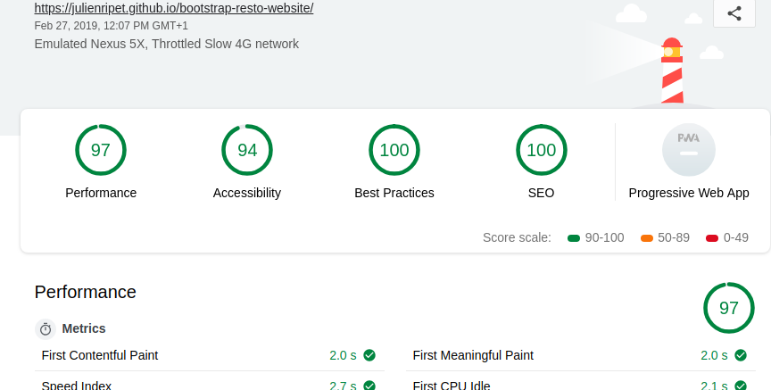

# bootstrap-resto-website 
## Travail solo réalisé durant mon stage chez Becode.

Les consignes étaient relativment sipmple, créer le site d'une chaine de restaurant fictive, avec quelques désirs du client imposé, et un mininum de 5 pages HTML. Nous avions 4 jours pour le réaliser.

J'ai d'abord fais des mockups papier, assez grossiers, mais qui me donnaient déjà une idée de vers quoi me diriger.

Après quoi, j'ai fait la bar de navigation, puis le footer, de ma page index. Ces éléments étant présents sur toutes mes pages, il m'a suffit de sauvegarder mon index sous différents nom pour avoir mes 4 autres pages HTML. J'avais donc mes 5 pages "vides", mais toutes déjà avec une navbar, un footer, un background et un jumbotron contenant mon h1. Plus qu'à remplir!

Peu d'endroits m'ont vraiment posé problème, l'utilisation de bootstrap permettant de rapidement créer les éléments et de les rendre responsive directement. Le plus gros du travail était le css, et les retouches constantes pour avoir un bon rendu sur toutes les tailles d'écrans. Une fois que je considerais une page "correcte" je lui faisais passer un audit avec lighthouse. Je retravaillais ensuite la page en fonction, afin d'atteindre les scores les plus hauts possibles.

C'était le premier travail où je devais vraiment faire attention aux ressources que j'utilisais, et j'ai donc dû apprendre comment rendre du script async, différé du css, ect. Il me reste toujours à travailler sur les PWA, mais je n'ai pas accordé assez de temps à la chose, et le peu que j'ai eu le temps de faire n'a pas l'air de fonctionner. Je le mettrais à jour plus tard sur une branch différente.

Pour conclure, je dirais que mon site n'est pas trè beau, mais il est fonctionnel, et réponds correctement à la demande initiale. N'ayant jamais été un grand graphiste dans l'âme, c'est un résultat escompté
